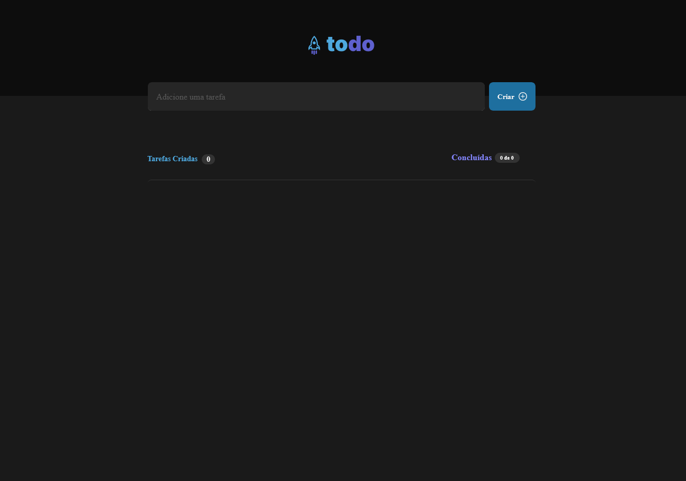

<h1 align="center"> ToDo List </h1>

Aplicação de controle de tarefas  

  <a href="#-tecnologias">Tecnologias</a>&nbsp;&nbsp;&nbsp;|&nbsp;&nbsp;&nbsp;
  <a href="#-projeto">Projeto</a>&nbsp;&nbsp;&nbsp;|&nbsp;&nbsp;&nbsp;
  <a href="#-layout">Layout</a>&nbsp;&nbsp;&nbsp;|&nbsp;&nbsp;&nbsp;
  <!-- <a href="#memo-licença">Licença</a> -->

<!-- 

  

 -->

 

  

## 🚀 Tecnologias

Esse projeto foi desenvolvido com as seguintes tecnologias:

- HTML e CSS
- JavaScript e TypeScript
- React
- Figma

## 💻 Projeto

ToDo List é um app  de controle de tarefas no estilo to-do list.

-[Visite o projeto online](https://santosmarcos95.github.io/TodoList/)

## 🔖 Layout

Você pode visualizar o layout do projeto através [DESSE LINK](https://www.figma.com/file/L4dsKFz89mXyTroyeeBjtl/ToDo-List-%E2%80%A2-Desafio-React-(Copy)?node-id=56%3A96&mode=dev). É necessário ter conta no [Figma](https://figma.com) para acessá-lo.

<!-- ## :memo: Licença

Esse projeto está sob a licença MIT. -->

<!-- ---

Feito com ♥ by Rocketseat :wave: [Participe da nossa comunidade!](https://discord.gg/rocketseat) -->
